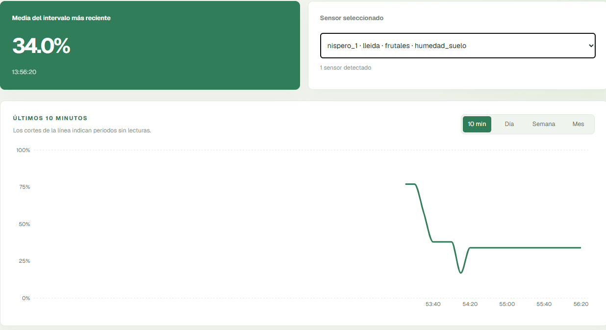

# 🌱 Smart Garden Monitoring System

An end-to-end IoT system for monitoring soil moisture in a garden or orchard using **ESP32, MQTT, Python, InfluxDB, and Next.js**.

The system collects sensor data at the edge, transports it through MQTT, processes it in a Python backend, stores historical measurements in a time-series database, and visualizes the data through a web dashboard.



> 🧪 **[Try the ESP32 simulation in Wokwi](https://wokwi.com/projects/474179510594150401)**

---

## 🏗️ Architecture

```text
┌─────────────────┐
│   ESP32 Node    │
│ ESP-IDF/FreeRTOS│
└────────┬────────┘
         │
         │ MQTT
         ▼
┌─────────────────┐
│  HiveMQ Broker  │
└────────┬────────┘
         │
         ▼
┌─────────────────┐
│  Python Worker  │
│ JSON validation │
│  Topic parsing  │
│ Data processing │
└────────┬────────┘
         │
         ▼
┌─────────────────┐
│    InfluxDB     │
│  Time-series DB │
└────────┬────────┘
         │
         ▼
┌─────────────────┐
│ Next.js Dashboard│
└─────────────────┘
```

The system is divided into five layers:

- **Embedded:** ESP32 firmware using ESP-IDF and FreeRTOS
- **Communication:** MQTT telemetry transport
- **Backend:** Python worker for validation, transformation, and persistence
- **Data:** InfluxDB time-series storage
- **Frontend:** Next.js and React dashboard

---

## 🎯 What This Project Demonstrates

- Embedded C development with **ESP-IDF**
- **FreeRTOS**-based firmware
- ADC sensor acquisition and calibration
- Wi-Fi and MQTT communication
- Event-driven backend development in Python
- JSON validation and topic parsing
- Time-series data modeling with InfluxDB
- Full-stack telemetry visualization
- Scalable MQTT topic architecture
- Firmware simulation with Wokwi

---

## ✨ Features

- Soil moisture measurement using the ESP32 ADC
- Two-point dry/wet sensor calibration
- MQTT telemetry publishing
- Structured device and sensor metadata
- JSON payload validation
- Historical telemetry storage
- Device and location-specific measurements
- Current and historical dashboard metrics
- Wokwi-based firmware testing

---

## 🧰 Tech Stack

| Layer             | Technologies                     |
| ----------------- | -------------------------------- |
| **Embedded**      | C, ESP32, ESP-IDF, FreeRTOS, ADC |
| **Communication** | MQTT, Paho MQTT, HiveMQ          |
| **Backend**       | Python                           |
| **Database**      | InfluxDB                         |
| **Frontend**      | Next.js, React, TypeScript       |
| **Simulation**    | Wokwi                            |
| **Tools**         | Git, GitHub, VS Code             |

---

## 🔌 Embedded System

The ESP32 acts as the edge node of the system.

The firmware:

1. Reads the soil moisture sensor through the ADC.
2. Converts the measurement into a calibrated moisture percentage.
3. Connects to Wi-Fi.
4. Publishes telemetry through MQTT.

Example payload:

```json
{
  "humedad_pct": 65.4,
  "voltaje_mv": 1850
}
```

Example MQTT topic:

```text
huerto/lleida/frutales/nispero_1/humedad
```

The topic contains contextual metadata:

```text
huerto/{location}/{type}/{device}/{sensor}
```

### Wokwi Simulation

The firmware can be tested without physical hardware using Wokwi.


**[▶ Open the Wokwi simulation](https://wokwi.com/projects/474179510594150401)**

---

## 📡 Backend & Data Pipeline

The Python worker subscribes to the MQTT topic pattern:

```text
huerto/+/+/+/humedad
```

This allows the same ingestion pipeline to process telemetry from multiple devices and locations.

```text
MQTT message
     ↓
JSON validation
     ↓
Topic parsing
     ↓
Data transformation
     ↓
InfluxDB
```

The worker extracts metadata from the MQTT topic and stores it as InfluxDB tags, while measured values are stored as fields.

For example:

**Tags**

```text
location
type
device
sensor
```

**Fields**

```text
humedad_pct
voltaje_mv
```

This separates identifying metadata from measured values and allows new devices to be added without creating device-specific ingestion handlers.


---

## 🌐 Dashboard

The frontend is built with **Next.js, React, and TypeScript**.

It provides:

- Current soil moisture
- Sensor voltage
- Historical measurements
- Device-specific telemetry
- Location-specific monitoring


---

## 📈 Scalability

The MQTT topic structure is designed around device context:

```text
huerto/{location}/{type}/{device}/{sensor}
```

For example:

```text
huerto/lleida/frutales/nispero_1/humedad
huerto/lleida/frutales/manzano_1/humedad
huerto/barcelona/huerta/tomate_1/humedad
```

The backend dynamically extracts this metadata instead of relying on hard-coded handlers for individual devices.

As a result, new devices and sensor streams can use the same ingestion pipeline.

---

## 📁 Project Structure

```text
.
├── firmware/
│   └── ESP32 firmware
│
├── backend/
│   └── MQTT ingestion worker
│
├── frontend-huerto/
│   └── Next.js dashboard
│
├── docs/
│   └── images/
│
├── README.md
└── .gitignore
```

---

## 🚀 Getting Started

### Firmware

Requires the ESP-IDF toolchain.

```bash
cd firmware

idf.py build
idf.py flash
idf.py monitor
```

Configuration can be accessed with:

```bash
idf.py menuconfig
```

### Backend

```bash
cd backend

python -m venv venv
```

Windows:

```bash
venv\Scripts\activate
```

Linux/macOS:

```bash
source venv/bin/activate
```

Install dependencies:

```bash
pip install -r requirements.txt
```

Configure the required environment variables and run:

```bash
python worker.py
```

### Frontend

```bash
cd frontend-huerto

npm install
npm run dev
```

The dashboard will be available at:

```text
http://localhost:3000
```

---

## 🔐 Security

This project currently uses a public MQTT broker for development and demonstration purposes.

Sensitive credentials are not stored in the repository.

- Secrets are loaded through environment variables.
- `.env` files remain local.
- Production deployment should use an authenticated MQTT broker with TLS.

---

## 🔭 Roadmap

- [ ] ESP32 deep sleep for lower power consumption
- [ ] MQTT authentication and TLS
- [ ] Dedicated production broker
- [ ] Battery and device health telemetry
- [ ] Low-moisture alerts
- [ ] Automatic irrigation control
- [ ] Docker deployment
- [ ] Automated tests and CI/CD
